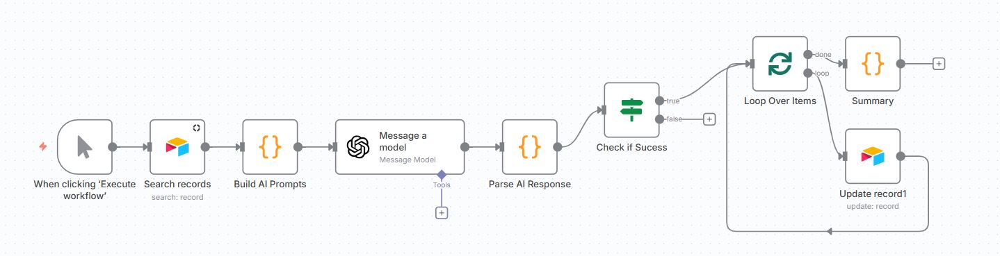
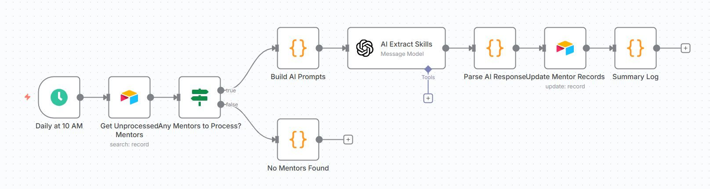

# AI-Powered Mentor Matching System

Built with n8n, Airtable, JavaScript and OpenAI

> **Helping startups and new companies find the perfect mentor to accelerate their growth**

## 💡 Goal

**The Challenge**: Early-stage companies and startups often struggle to find the right mentor who truly understands their specific industry, challenges, and growth stage. Traditional networking is time-consuming, and finding someone with relevant expertise feels like searching for a needle in a haystack.

**Solution**: An AI-powered system that automatically analyzes mentor expertise and matches startups with the most suitable mentors based on their unique needs - delivering personalized recommendations in seconds, not weeks.

## 🎯 How It Helps Startups

### For Startup Founders:

- **Find Your Perfect Match**: Describe your business challenges in plain language, get matched with mentors who've solved similar problems
- **Save Time**: Get top 5 mentor recommendations instantly instead of spending weeks networking
- **Understand Why**: Every recommendation comes with clear reasoning about why this mentor fits your needs

### For Mentors:

- **Better Matches**: Mentor's profile is automatically analyzed to identify your core expertise areas
- **Relevant Connections**: They get matched only with companies that need your specific skills
- **Clear Classification**: Mentor's experience is categorized into primary, secondary, and tertiary expertise areas

## ✨ What Makes This Special

- 🎯 **Smart Matching**: Goes beyond keywords - understands context and expertise depth
- ⚡ **Instant Results**: From company need to mentor recommendations in seconds
- 📊 **Transparent**: Clear explanations for every match
- 🔄 **Scalable**: Works whether you have 10 or 1000 mentors in your network

## 📊 Workflows

**Phase 1: Mentor Profile Processing**

- Processed profiles using AI to extract and categorize their expertise areas.
- Each mentor's skills were analyzed and classified into primary, secondary, and tertiary categories across various sectors including CyberSecurity, E-commerce, etc.

**Phase 2: Daily Mentor Skill Extraction**

- Runs daily at 10 AM to automatically identify and process newly added or unprocessed mentor profiles.
- Uses OpenAI to extract and categorize skills from new mentors, then updates their records in Airtable.
- Ensures all mentor data is current and ready for matching without manual intervention.

**Phase 3: Company Matching**

- Companies type their requirements in the frontend interface and receive the top 3 best-matched mentors with AI-generated explanations.
- The system analyzes mentor's data using OpenAI and returns detailed profiles including match scores, skills, and contact information.
- All matching requests are automatically logged to Airtable for analytics and tracking.

This project uses:

- **n8n** (workflow automation) - Can be deployed via Docker or n8n Cloud
- **Airtable** (database) - Stores mentor profiles and match history
- **OpenAI API** (AI/LLM) - Powers skill extraction and matching
